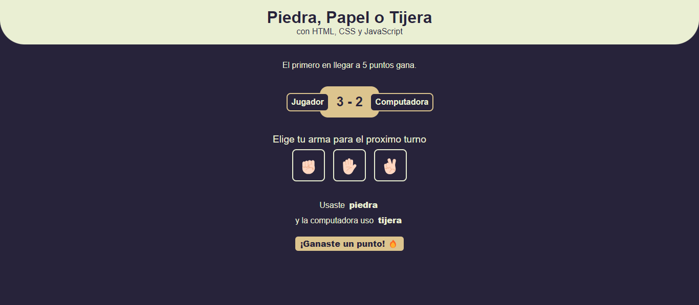

# Piedra, Papel o Tijera

Este proyecto es una version sencilla del clásico juego de Piedra, Papel o Tijera, desarrollado con HTML, CSS y JavaScript. Es un ejemplo de cómo crear una interfaz de usuario interactiva y funcional utilizando tecnologías front-end básicas.

## Descripción

El juego consiste en competir contra la computadora para ver quién llega primero a 5 puntos. El jugador selecciona entre piedra, papel o tijera, y la computadora hace una elección al azar. Las reglas clásicas del juego se aplican: piedra vence a tijera, tijera vence a papel, y papel vence a piedra.

## Funcionalidades

- **Interfaz de Usuario**: Diseño simple y atractivo utilizando CSS para una experiencia de juego agradable.
- **Lógica de Juego**: Implementación de la lógica del juego utilizando JavaScript para determinar el ganador de cada ronda.
- **Sistema de Puntuación**: Se lleva un registro de los puntos obtenidos por el jugador y la computadora. El primero en llegar a 5 puntos gana.
- **Reinicio del Juego**: Opción para reiniciar el juego una vez que se alcanza el puntaje máximo.

## Estructura del Proyecto

El proyecto está compuesto por tres archivos principales:

- **`index.html`**: Contiene la estructura básica del juego y el contenido visual.
- **`style.css`**: Define los estilos y la apariencia del juego.
- **`script.js`**: Implementa la lógica del juego y las interacciones del usuario.

## Uso

Para jugar al juego, simplemente abre el archivo `index.html` en tu navegador web preferido. Verás las instrucciones en pantalla y podrás seleccionar tu movimiento haciendo clic en uno de los botones correspondientes. El juego mostrará el resultado de cada ronda y actualizará el puntaje hasta que uno de los jugadores alcance los 5 puntos.

## Capturas de Pantalla

## Tecnologías Utilizadas

- **HTML**: Estructura y contenido del juego.
- **CSS**: Estilos y diseño visual.
- **JavaScript**: Lógica del juego y manipulación del DOM.

## Mejoras Futuras

Algunas mejoras que podrían implementarse en el futuro incluyen:

- **Añadir más estilos y animaciones** para hacer el juego más atractivo visualmente.
- **Incorporar un modo multijugador** donde dos jugadores puedan competir entre sí.
- **Guardar el puntaje máximo** alcanzado para crear un récord.

## Contribuciones

Las contribuciones son bienvenidas. Si deseas mejorar este proyecto, puedes hacerlo mediante un fork de este repositorio y luego enviar un pull request con tus cambios.

## Créditos

Este proyecto fue realizado basandose en el proyecto de [Matias Coletta](https://github.com/carpicoder). 
Agradezco al autor por compartir sus conocimientos y recursos.

Puedes encontrar el video de como realizarlo en el siguiente enlace: [Enlace del video](https://youtu.be/QZ6iJG1mQFM).

---

¡Gracias por jugar y contribuir!
